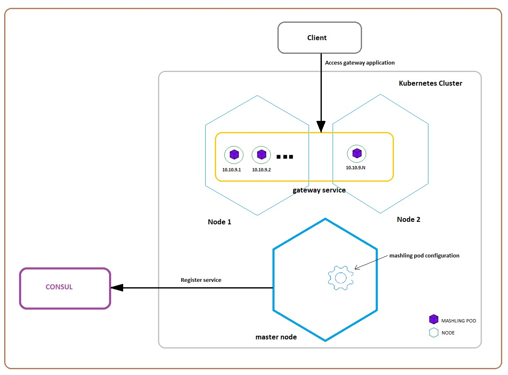
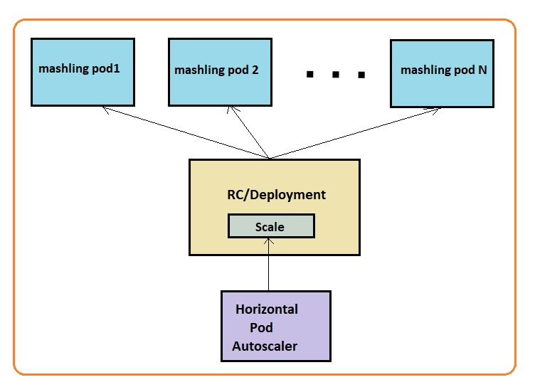
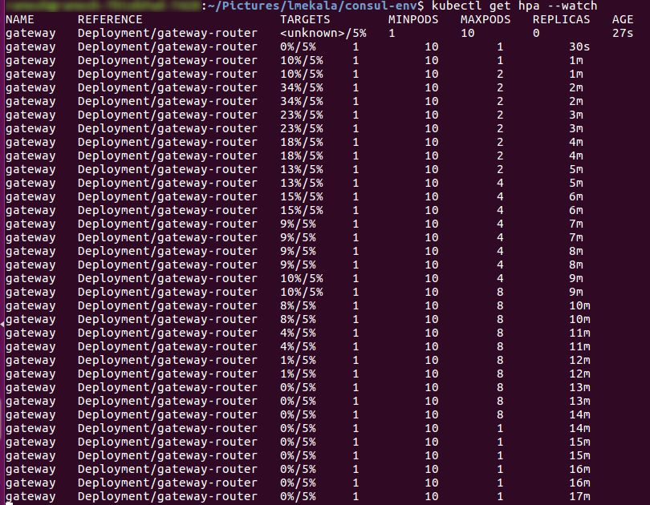

# HA Kubernetes recipe with consul service discovery
This recipe will walk you through creating the files needed to deploy to Highly Available Kubernetes and registering services running on kubernetes with Consul

Pictorial representation of the recipe solution:


### Prerequisites
Following prerequisites needs to be installed:
* Docker (and an account for Docker Hub)
* A Kubernetes environment [here](https://kubernetes.io/docs/setup/pick-right-solution/) (for example [minikube](https://github.com/kubernetes/minikube), [Kubeadm-dind](https://github.com/kubernetes-sigs/kubeadm-dind-cluster))
* [Heapster](https://github.com/kubernetes/heapster) for grapical dashboard on Kubernetes
* [metrics-server](https://github.com/kubernetes-incubator/metrics-server) for capturing metrics of HPA on Kubernetes 
* Download [consul](https://www.consul.io/downloads.html) binary and update PATH environment variable to include consul binary.

### Preparing the gateway
* Download the Mashling-Gateway Linux Binary from [Mashling-releases](https://github.com/TIBCOSoftware/mashling/releases). 

### Creating a Docker image
Create a folder mashling and place the downloaded mashling-gateway and mashling.json in the folder.

```
$ cp Dockerfile mashling
$ cd mashling
$ docker login
$ docker build -t <YOUR DOCKER USER>/mashling-kube .
$ docker push <YOUR DOCKER USER>/mashling-kube
```

### Create kubernetes cluster
For creating multi node cluster on local machine, refer [here](https://kubernetes.io/docs/setup/pick-right-solution/). We will be creating kubeadm-dind cluster with 3 nodes. kubeadm-dind-cluster supports k8s versions 1.8.x, 1.9.x and 1.10.x. This may be convenient to use with projects that extend or use Kubernetes. For example, you can start Kubernetes 1.8 like this:

```
$ wget https://cdn.rawgit.com/kubernetes-sigs/kubeadm-dind-cluster/master/fixed/dind-cluster-v1.8.sh
$ chmod +x dind-cluster-v1.8.sh

$ # start the cluster
$ ./dind-cluster-v1.8.sh up

$ # stop the cluster
$ ./dind-cluster-v1.8.sh down

$ # remove DIND containers and volumes
$ ./dind-cluster-v1.8.sh clean

$ # add kubectl directory to PATH
$ export PATH="$HOME/.kubeadm-dind-cluster:$PATH"
```


Replace 1.8 with 1.9 or 1.10 to use other Kubernetes versions.

### Kubernetes dashboard setup

For accesing kubernetes dashboard with graphs, update below changes in heapster/deploy/kube-config/influxdb
```
grafana.yaml --> heapster-grafana-amd64:v5.0.4 to heapster-grafana-amd64:v4.4.3
influxdb.yaml --> heapster-influxdb-amd64:v1.5.2 to heapster-influxdb-amd64:v1.3.3
``` 
Deploy heapster and metrics-server
```
$ kubectl apply -f heapster/deploy/kube-config/rbac/heapster-rbac.yaml
$ kubectl create -f heapster/deploy/kube-config/influxdb/influxdb.yaml
$ kubectl create -f heapster/deploy/kube-config/influxdb/grafana.yaml
$ kubectl create -f heapster/deploy/kube-config/influxdb/heapster.yaml

# Kubernetes 1.7
$ kubectl create -f metrics-server/deploy/1.7/

# Kubernetes > 1.8
$ kubectl create -f metrics-server/deploy/1.8+/
```
Restart of kubernetes dashboard is required for heapster to show metrics
```
$ kubectl get pod <DASHBOARD-POD-NAME> -n kube-system -o yaml | kubectl replace --force -f -
```

### Consul setup

Open new terminal and run consul agent using below command.
```
$ consul agent -dev -client <HOSTIP>
```
Note: Consul agent can be run in secure mode by providing authentication token in a configuration file while launching the agent.<br>
Sample configuration json file content:
```json
{
  "acl_datacenter": "dc1",
  "acl_master_token": "b1gs33cr3t",
  "acl_default_policy": "deny",
  "acl_down_policy": "extend-cache"
}
```
Additional configuration details can be found [here](https://www.consul.io/docs/guides/acl.html)

Command to run consul agent with the directory containing configuration json file.
```
$ consul agent -dev -client <HOSTIP> -config-dir <CONFIG DIRECTORY PATH>
```
Note: For our usecase we will be using consul token

### Deploying app on Kubernetes
To run the gateway on K8s with Horizontal Pod Autoscaler you need to create a deployment, service and hpa. 

```
$ cp ../deployment.yml ./
$ cp ../service.yml ./
$ cp ../autoscale.yml ./
```

Add your docker user and port number to the deployment.yaml file:

```
spec:
      containers:
      - name: gateway-router
        image: <YOUR DOCKER USER>/mashling-kube
        imagePullPolicy: Always
        ports:
        - containerPort: 9096
```

Update deployment name port number details in service.yml and autoscale.yml files.

Deploy the app to kubernetes cluster.
```
## Create K8s deployment
$ kubectl apply -f deployment.yml

## Create K8s service
$ kubectl apply -f service.yml

## Create K8s hpa
$ kubectl apply -f autoscale.yml
```

### Register gateway app with consul
Register the services running on kubernetes to consul dashboard using register-consul bash file. User need to pass consul hostIP and consul token as arguments to bash file.

Access consul dashboard on browser
```
http://<HOSTIP>:8500/ui
```

If kubernetes cluster is running on local machine. Run bash file

```
$ cp ../register-consul.sh ./
$ chmod ugo+x ./register-consul.sh
$ ./register-consul.sh <HOSTIP> <CONSUL-TOKEN>
```

Consul dashboard view 

If kubernetes cluster is running on cloud or on-prem, Update the content in register-consul bash file
```
"$(kubectl get nodes -o jsonpath='{ $.items[*].status.addresses[?(@.type=="InternalIP")].address }')" 
with 
"$(kubectl get nodes -o jsonpath='{ $.items[*].status.addresses[?(@.type=="ExternalIP")].address }')"
```

After making above changes run bash file along with arguments as shown above.

For continous health check of services running on kubernetes, run the register consul bash file as cron, below command runs every 10 seconds
```
watch -n 10 ./register-consul.sh <HOSTIP> <CONSUL-TOKEN>
```

### Testing 
You can now test the gateway app by simply executing a cURL command:
```
$ curl http://<K8s external IP>:30061/hello/world
```

If you're using kubeadm-dind-cluster you can get the cluster IP address by running
```
$ kubectl get nodes -o jsonpath='{ $.items[0].status.addresses[?(@.type=="InternalIP")].address }'
```

For Testing Horizontal Pod Autoscaler, increase the load on the endpoint.

```
$ while true;do curl http://<K8s external IP>:30061/pets/1 ; done
```



Open new terminal and execute the HPA service as cron using below command. 
```
$ kubectl get hpa --watch
```



### Access kubernetes and grafana dashboard

To access dashboards run
```
$ kubectl cluster-info
```


Grafana dashboard view


